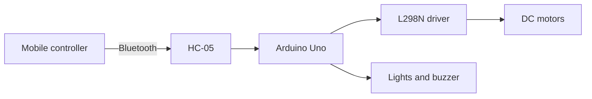

# Bluetooth-Controlled Arduino Car

<p align="center">
  <strong>A complete embedded robotics project for real-time wireless vehicle control.</strong>
</p>

<p align="center">
  
  
  
  <a href="LICENSE"></a>
</p>


## Overview

This robotic car receives movement and accessory commands over an HC-05 Bluetooth module. Arduino firmware interprets the commands and controls the motors, front and rear lights, and buzzer.

## Features

- Forward, reverse, left, right, and stop controls
- Four DC gear motors through an L298N motor driver
- HC-05 serial Bluetooth communication
- Independent front and rear lights
- Buzzer control
- Predefined movement modes
- Circuit documentation and component list

## Architecture



## Hardware

| Component | Quantity |
|---|---:|
| Arduino Uno | 1 |
| HC-05 Bluetooth module | 1 |
| L298N motor driver | 1 |
| DC gear motors | 4 |
| Wheels | 4 |
| Robot chassis | 1 |
| Battery pack | 1 |
| Front LEDs | 2 |
| Rear LEDs | 2 |
| Buzzer | 1 |

See [hardware/components.md](hardware/components.md) and the [schematic](hardware/schematic.pdf).

## Repository structure

```text
├── arduino/
│   └── Bluetooth_Car/
│       └── Bluetooth_Car.ino
├── hardware/
│   ├── components.md
│   ├── schematic.pdf
│   └── schematic.png
└── media/
    └── car.jpg
```

## Upload the firmware

1. Open `arduino/Bluetooth_Car/Bluetooth_Car.ino` in the Arduino IDE.
2. Select the correct Arduino board and serial port.
3. Disconnect the HC-05 from the Arduino serial pins if it interferes with uploading.
4. Upload the sketch.
5. Reconnect the Bluetooth module and test commands with the motors raised off the surface.

## Mobile controller

The project was built with a custom Android control interface. The Android application source is not currently included in this repository. The Arduino firmware can also be tested with a compatible Bluetooth serial-terminal application that sends the expected commands.

## Power and safety

- Use a motor supply suitable for the motors and driver.
- Connect the Arduino, driver, and Bluetooth grounds together.
- Do not power the motors directly from the Arduino 5 V pin.
- Verify motor direction with the wheels off the ground before driving.

## License

Released under the [MIT License](LICENSE).

## Author

Created by [Unes Jami](https://github.com/unesjami).
