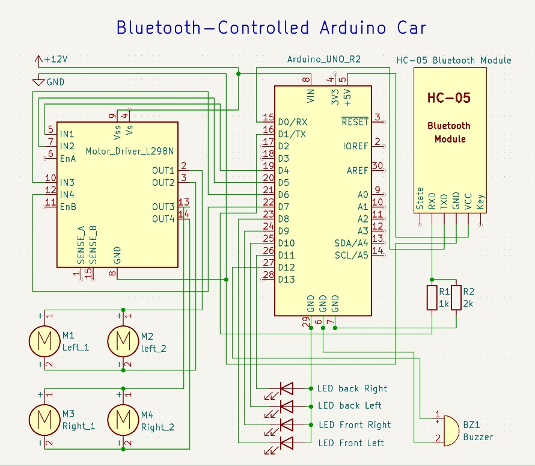
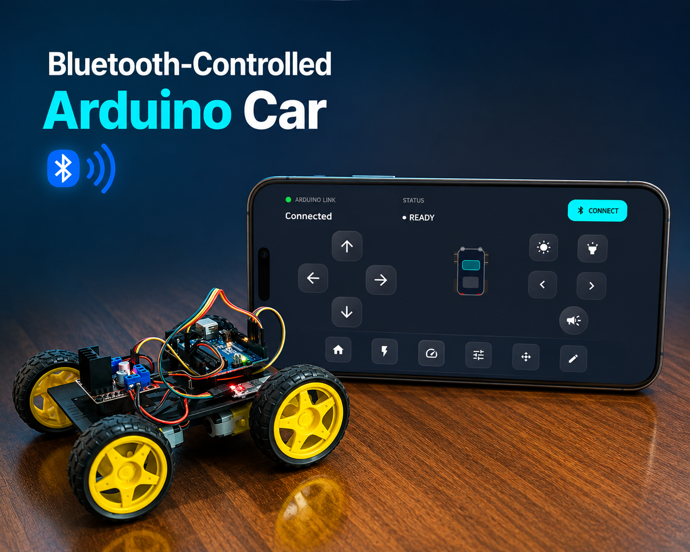

# 🚗 Bluetooth-Controlled Arduino Car

A Bluetooth-controlled robotic car built with **Arduino** and a **custom Android application**. This project combines embedded programming, electronics design, Bluetooth communication, and mobile development to create a complete wireless robotic control system.

---

## ✨ Features

- 📱 Custom Android control application
- 📡 Bluetooth communication (HC-05)
- 🤖 Arduino-based motor control
- 🚗 Forward, Backward, Left, Right & Stop
- 💡 Front and rear LED control
- 🔊 Buzzer control
- 💃 Multiple predefined movement modes

---

## 🧠 System Architecture

```text
Android App
     │
 Bluetooth
     ▼
   HC-05
     │
     ▼
  Arduino Uno
     │
     ▼
 L298N Motor Driver
     │
     ▼
 DC Motors
```

---

## 🛠️ Hardware Components

| Component | Quantity |
|-----------|:--------:|
| Arduino Uno | 1 |
| HC-05 Bluetooth Module | 1 |
| L298N Motor Driver | 1 |
| DC Gear Motors | 4 |
| Robot Chassis | 1 |
| Wheels | 4 |
| Battery Pack | 1 |
| White LEDs | 2 |
| Red LEDs | 2 |
| Buzzer | 1 |

For the complete list, see **[hardware/components.md](hardware/components.md)**.

---

## 📂 Project Structure

```text
Arduino-Bluetooth-Car/
│
├── arduino/
│   └── Bluetooth_Car.ino
│
├── hardware/
│   ├── schematic.png
│   ├── schematic.pdf
│   └── components.md
│
├── media/
│   └── car.jpg
│
├── README.md
├── LICENSE
└── .gitignore
```

---

## 🔌 Circuit Schematic



---

## 📷 Project



---

## 🎯 My Contributions

- Designed the complete electronic schematic
- Developed the Arduino firmware
- Built the custom Android control application
- Implemented Bluetooth communication
- Integrated hardware and software
- Tested and validated the complete system

---

## 💻 Technologies

- Arduino
- C/C++
- Android Studio
- Bluetooth (HC-05)
- Embedded Systems
- Electronics
- Robotics

---

## 📄 License

This project is licensed under the **MIT License**.

---

## 👨‍💻 Author

**Unes Jami**

*Mechatronics & Robotics | Embedded Systems | AI & Digital Solutions*